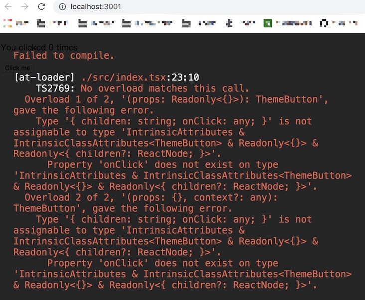

> 本文转自: [宇宙来信](https://segmentfault.com/u/liuyan666)   
> 原文链接: https://segmentfault.com/a/1190000021953371

三篇长文，4W余字，带你解锁 `webpack` ，希望读完这三篇文章，你能够对 `webpack` 的各项配置有一个更为清晰的认识。

### 1.webpack 是什么？

`webpack` 是一个现代 `JavaScript` 应用程序的静态模块打包器，当 `webpack` 处理应用程序时，会递归构建一个依赖关系图，其中包含应用程序需要的每个模块，然后将这些模块打包成一个或多个 `bundle`。

### 2.webpack 的核心概念

*   entry: 入口
*   output: 输出
*   loader: 模块转换器，用于把模块原内容按照需求转换成新内容
*   插件(plugins): 扩展插件，在webpack构建流程中的特定时机注入扩展逻辑来改变构建结果或做你想要做的事情

### 3.初始化项目

新建一个文件夹，如: `webpack-first` (当然，你可以使用任意一个你喜欢的项目名)。推荐大家参考本文一步一步进行配置，不要总是在网上找什么最佳配置，你掌握了`webpack`之后，根据自己的需求配置出来的，就是最佳配置。

本篇文章对应的项目地址(编写本文时使用): [https://github.com/YvetteLau/...](https://link.segmentfault.com/?enc=6zvnmbT5CyTU9qb8iDWi%2FQ%3D%3D.iBPavbbDX49xAonmMa5O05pvFpXMD4n1IhECPCPl92vu4ytnxYviA2HaOFo55Fbcc1AYdZaveamWVfuQS2G8mA%3D%3D)

使用 `npm init -y` 进行初始化(也可以使用 `yarn`)。

要使用 `webpack`，那么必然需要安装 `webpack`、`webpack-cli`:

npm install webpack webpack-cli -D

鉴于前端技术变更迅速，祭出本篇文章基于 `webpack` 的版本号:

├── webpack@4.41.5 
└── webpack-cli@3.3.10 

从 `wepack V4.0.0` 开始， `webpack` 是开箱即用的，在不引入任何配置文件的情况下就可以使用。

新建 `src/index.js` 文件，我们在文件中随便写点什么:
``` js
//index.js
class Animal {
    constructor(name) {
        this.name = name;
    }
    getName() {
        return this.name;
    }
}

const dog = new Animal('dog');
```
使用 `npx webpack --mode=development` 进行构建，默认是 `production` 模式，我们为了更清楚得查看打包后的代码，使用 `development` 模式。

可以看到项目下多了个 `dist` 目录，里面有一个打包出来的文件 `main.js`。

`webpack` 有默认的配置，如默认的入口文件是 `./src`，默认打包到`dist/main.js`。更多的默认配置可以查看: `node_modules/webpack/lib/WebpackOptionsDefaulter.js`。

查看 `dist/main.js` 文件，可以看到，`src/index.js` 并没有被转义为低版本的代码，这显然不是我们想要的。
``` js
{
    "./src/index.js":
        (function (module, exports) {

            eval("class Animal {\\n    constructor(name) {\\n        this.name = name;\\n    }\\n    getName() {\\n        return this.name;\\n    }\\n}\\n\\nconst dog = new Animal('dog');\\n\\n//# sourceURL=webpack:///./src/index.js?");

        })
}
```
### 4.将JS转义为低版本

前面我们说了 `webpack` 的四个核心概念，其中之一就是 `loader`，`loader` 用于对源代码进行转换，这正是我们现在所需要的。

将JS代码向低版本转换，我们需要使用 `babel-loader`。

#### babel-loader

首先安装一下 `babel-loader`

npm install babel-loader -D

此外，我们还需要配置 `babel`，为此我们安装一下以下依赖:

npm install @babel/core @babel/preset-env @babel/plugin-transform-runtime -D

npm install @babel/runtime @babel/runtime-corejs3

对babel7配置不熟悉的小伙伴，可以阅读一下这篇文章: [不可错过的 Babel7 知识](https://link.segmentfault.com/?enc=X7rYJdxoarklWq%2Fl1UCbWg%3D%3D.L2HiFOuPXArpvEUHI056Fri9qOUIiPnn4QzTa7qEPW3rBkMXWiy%2BiIQKTrTB7Gaj)

新建 `webpack.config.js`，如下:
``` js
//webpack.config.js
module.exports = {
    module: {
        rules: [
            {
                test: /\\.jsx?$/,
                use: ['babel-loader'],
                exclude: /node\_modules/ //排除 node\_modules 目录
            }
        ]
    }
}
```
建议给 `loader` 指定 `include` 或是 `exclude`，指定其中一个即可，因为 `node_modules` 目录通常不需要我们去编译，排除后，有效提升编译效率。

这里，我们可以在 `.babelrc` 中编写 `babel` 的配置，也可以在 `webpack.config.js` 中进行配置。

#### 创建一个 .babelrc

配置如下：
``` js
{
    "presets": ["@babel/preset-env"],
    "plugins": [
        [
            "@babel/plugin-transform-runtime",
            {
                "corejs": 3
            }
        ]
    ]
}
```
现在，我们重新执行 `npx webpack --mode=development`，查看 `dist/main.js`，会发现已经被编译成了低版本的JS代码。

#### 在webpack中配置 babel
``` js
//webpack.config.js
module.exports = {
    // mode: 'development',
    module: {
        rules: [
            {
                test: /\\.jsx?$/,
                use: {
                    loader: 'babel-loader',
                    options: {
                        presets: ["@babel/preset-env"],
                        plugins: [
                            [
                                "@babel/plugin-transform-runtime",
                                {
                                    "corejs": 3
                                }
                            ]
                        ]
                    }
                },
                exclude: /node\_modules/
            }
        ]
    }
}
```
这里有几点需要说明：

*   `loader` 需要配置在 `module.rules` 中，`rules` 是一个数组。
*   `loader` 的格式为:
``` js
{
    test: /\\.jsx?$/,//匹配规则
    use: 'babel-loader'
}
```
或者也可以像下面这样:
``` js
//适用于只有一个 loader 的情况
{
    test: /\\.jsx?$/,
    loader: 'babel-loader',
    options: {
        //...
    }
}
```
`test` 字段是匹配规则，针对符合规则的文件进行处理。

`use` 字段有几种写法

*   可以是一个字符串，例如上面的 `use: 'babel-loader'`
*   `use` 字段可以是一个数组，例如处理CSS文件是，`use: ['style-loader', 'css-loader']`
*   `use` 数组的每一项既可以是字符串也可以是一个对象，当我们需要在`webpack` 的配置文件中对 `loader` 进行配置，就需要将其编写为一个对象，并且在此对象的 `options` 字段中进行配置，如：
``` js
rules: [
    {
        test: /\\.jsx?$/,
        use: {
            loader: 'babel-loader',
            options: {
                presets: ["@babel/preset-env"]
            }
        },
        exclude: /node\_modules/
    }
]
```
上面我们说了如何将JS的代码编译成向下兼容的代码，当然你可以还需要一些其它的 `babel` 的插件和预设，例如 `@babel/preset-react`，`@babel/plugin-proposal-optional-chaining` 等，不过，`babel` 的配置并非本文的重点，我们继续往下。

不要说细心的小伙伴了，即使是粗心的小伙伴肯定也发现了，我们在使用 `webpack` 进行打包的时候，一直运行的都是 `npx webpack --mode=development` 是否可以将 `mode` 配置在 `webpack.config.js` 中呢？显然是可以的。

### 5.mode

将 `mode` 增加到 `webpack.config.js` 中:
``` js
module.exports = {
    //....
    mode: "development",
    module: {
        //...
    }
}
```
`mode` 配置项，告知 `webpack` 使用相应模式的内置优化。

`mode` 配置项，支持以下两个配置:

*   `development`：将 `process.env.NODE_ENV` 的值设置为 `development`，启用 `NamedChunksPlugin` 和 `NamedModulesPlugin`
*   `production`：将 `process.env.NODE_ENV` 的值设置为 `production`，启用 `FlagDependencyUsagePlugin`, `FlagIncludedChunksPlugin`, `ModuleConcatenationPlugin`, `NoEmitOnErrorsPlugin`, `OccurrenceOrderPlugin`, `SideEffectsFlagPlugin` 和 `UglifyJsPlugin`

现在，我们之间使用 `npx webpack` 进行编译即可。

### 6.在浏览器中查看页面

搞了这么久，还不能在浏览器中查看页面，这显然不能忍！

查看页面，难免就需要 `html` 文件，有小伙伴可能知道，有时我们会指定打包文件中带有 `hash`，那么每次生成的 `js` 文件名会有所不同，总不能让我们每次都人工去修改 `html`，这样不是显得我们很蠢嘛~

我们可以使用 `html-webpack-plugin` 插件来帮助我们完成这些事情。

首先，安装一下插件:

npm install html-webpack-plugin -D 

新建 `public` 目录，并在其中新建一个 `index.html` 文件( 文件内容使用 `html:5` 快捷生成即可)

修改 `webpack.config.js` 文件。
``` js
//首先引入插件
const HtmlWebpackPlugin = require('html-webpack-plugin');
module.exports = {
    //...
    plugins: [
        //数组 放着所有的webpack插件
        new HtmlWebpackPlugin({
            template: './public/index.html',
            filename: 'index.html', //打包后的文件名
            minify: {
                removeAttributeQuotes: false, //是否删除属性的双引号
                collapseWhitespace: false, //是否折叠空白
            },
            // hash: true //是否加上hash，默认是 false
        })
    ]
}
```
此时执行 `npx webpack`，可以看到 `dist` 目录下新增了 `index.html` 文件，并且其中自动插入了 `<script>` 脚本，引入的是我们打包之后的 js 文件。

这里要多说一点点东西，`HtmlWebpackPlugin` 还为我们提供了一个 `config` 的配置，这个配置可以说是非常有用了。

#### html-webpack-plugin 的 config 的妙用

有时候，我们的脚手架不仅仅给自己使用，也许还提供给其它业务使用，`html` 文件的可配置性可能很重要，比如：你公司有专门的部门提供M页的公共头部/公共尾部，埋点jssdk以及分享的jssdk等等，但是不是每个业务都需要这些内容。

一个功能可能对应多个 `js` 或者是 `css` 文件，如果每次都是业务自行修改 `public/index.html` 文件，也挺麻烦的。首先他们得搞清楚每个功能需要引入的文件，然后才能对 `index.html` 进行修改。

此时我们可以增加一个配置文件，业务通过设置 `true` 或 `false` 来选出自己需要的功能，我们再根据配置文件的内容，为每个业务生成相应的 `html` 文件，岂不是美美的。

Let's Go!

首先，我们在 `public` 目录下新增一个 `config.js` ( 文件名你喜欢叫什么就叫什么 )，将其内容设置为:
``` js
//public/config.js 除了以下的配置之外，这里面还可以有许多其他配置，例如,pulicPath 的路径等等
module.exports = {
    dev: {
        template: {
            title: '你好',
            header: false,
            footer: false
        }
    },
    build: {
        template: {
            title: '你好才怪',
            header: true,
            footer: false
        }
    }
}
```
现在，我们修改下我们的 `webpack.config.js`:
``` js
//webpack.config.js
const HtmlWebpackPlugin = require('html-webpack-plugin');
const isDev = process.env.NODE\_ENV === 'development';
const config = require('./public/config')[isDev ? 'dev' : 'build'];

modue.exports = {
    //...
    mode: isDev ? 'development' : 'production'
    plugins: [
        new HtmlWebpackPlugin({
            template: './public/index.html',
            filename: 'index.html', //打包后的文件名
            config: config.template
        })
    ]
}
```
相应的，我们需要修改下我们的 `public/index.html` 文件(嵌入的js和css并不存在，仅作为示意)：
``` html
<!DOCTYPE html>
<html lang="en">
<head>
    <meta charset="UTF-8">
    <meta name="viewport" content="width=device-width, initial-scale=1.0">
    <meta http-equiv="X-UA-Compatible" content="ie=edge">
    <% if(htmlWebpackPlugin.options.config.header) { %>
    <link rel="stylesheet" type="text/css" href="//common/css/header.css">
    <% } %>
    <title><%= (htmlWebpackPlugin.options.config.title) %></title>
</head>

<body>
</body> 
<% if(htmlWebpackPlugin.options.config.header) { %>
<script src="//common/header.min.js" type="text/javascript"></script> 
<% } %>
</html>
```
`process.env` 中默认并没有 `NODE_ENV`，这里配置下我们的 `package.json` 的 `scripts`.

为了兼容Windows和Mac，我们先安装一下 `cross-env`:
```
npm install cross\-env -D

{
    "scripts": {
        "dev": "cross-env NODE\_ENV=development webpack",
        "build": "cross-env NODE\_ENV=production webpack"
    }
}
```
然后我们运行 `npm run dev` 和 运行 `npm run build` ，对比下 `dist/index.html` ，可以看到 `npm run build`，生成的 `index.html` 文件中引入了对应的 `css` 和 `js`。并且对应的 `title` 内容也不一样。

你说这里是不是非得是用 `NODE_ENV` 去判断？当然不是咯，你写 `aaa=1` ，`aaa=2` 都行（当然啦，`webpack.config.js` 和 `scripts` 都需要进行相应修改），但是可能会被后面接手的人打死。

更多[html-webpack-plugin配置项](https://link.segmentfault.com/?enc=Ycz9asj7WJdSZT4M7HHVAQ%3D%3D.jP0AIQbO%2BAiVu0P%2B9qR18qf3BexfZaP2U6CWlCrV%2BM9LUht1CWiNSf1doxFzDCOpJSEf65jspV2XEtgFI0Bfzg%3D%3D)

#### 如何在浏览器中实时展示效果

说了这么多，到现在还没能在浏览器中实时查看效果，是不是已经有点捉急了，先看一下如何实时查看效果吧，不然都不知道自己配得对不对。

话不多说，先装依赖:

npm install webpack-dev-server -D

修改下咱们的 `package.json` 文件的 `scripts`：
``` json
"scripts": {
    "dev": "NODE\_ENV=development webpack-dev-server",
    "build": "NODE\_ENV=production webpack"
},
```
在控制台执行 `npm run dev`，启动正常，页面上啥也没有，修改下我们的JS代码，往页面中增加点内容，正常刷新(也就是说不需要进行任何配置就可以使用了)。

Excuse me。怪我平时不认真咯，每次都乖乖的配个 `contentBase`，原来根本不需要配，带着疑问，我又去搜寻了一番。

原来在配置了 `html-webpack-plugin` 的情况下， `contentBase` 不会起任何作用，也就是说我以前都是白配了，这是一个悲伤的故事。

不过呢，我们还是可以在 `webpack.config.js` 中进行 `webpack-dev-server` 的其它配置，例如指定端口号，设置浏览器控制台消息，是否压缩等等:
``` js
//webpack.config.js
module.exports = {
    //...
    devServer: {
        port: '3000', //默认是8080
        quiet: false, //默认不启用
        inline: true, //默认开启 inline 模式，如果设置为false,开启 iframe 模式
        stats: "errors-only", //终端仅打印 error
        overlay: false, //默认不启用
        clientLogLevel: "silent", //日志等级
        compress: true //是否启用 gzip 压缩
    }
}
```
*   启用 `quiet` 后，除了初始启动信息之外的任何内容都不会被打印到控制台。这也意味着来自 `webpack` 的错误或警告在控制台不可见 ———— 我是不会开启这个的，看不到错误日志，还搞个锤子
*   `stats`: "errors-only" ， 终端中仅打印出 `error`，注意当启用了 `quiet` 或者是 `noInfo` 时，此属性不起作用。 ————— 这个属性个人觉得很有用，尤其是我们启用了 `eslint` 或者使用 `TS`进行开发的时候，太多的编译信息在终端中，会干扰到我们。
*   启用 `overlay` 后，当编译出错时，会在浏览器窗口全屏输出错误，默认是关闭的。


*   `clientLogLevel`: 当使用内联模式时，在浏览器的控制台将显示消息，如：在重新加载之前，在一个错误之前，或者模块热替换启用时。如果你不喜欢看这些信息，可以将其设置为 `silent` (`none` 即将被移除)。

本篇文章不是为了细说 `webpack-dev-server` 的配置，所以这里就不多说了。关于 `webpack-dev-server` 更多的配置可以[点击查看](https://link.segmentfault.com/?enc=E0D6J9sNslGaFyzfa0DDvA%3D%3D.GhSFNc5HfQKiR6%2Fs%2Ba5LJl8C%2F8JmYcCgZ7ejx9gNTeYOA6X8oWJkxsBRS1QrsLcDUq6RS74RA1KRwi%2Bqqdv5xQ%3D%3D)。

细心的小伙伴可能发现了一个小问题，我们在`src/index.js`中增加一句 `console.log('aaa')`：
``` js
class Animal {
    constructor(name) {
        this.name = name;
    }
    getName() {
        return this.name;
    }
}

const dog = new Animal('dog');
console.log('aaa');
```
然后通过 `npm run dev` 查看效果，会发现：

这显然不是我们源码中对应的行号，点进去的话，会发现代码是被编译后的，我当前的代码非常简单，还能看出来，项目代码复杂后，“亲妈”看编译后都费劲，这不利于我们开发调试，不是我们想要的，我们肯定还是希望能够直接对应到源码的。

### 7.devtool

`devtool` 中的一些设置，可以帮助我们将编译后的代码映射回原始源代码。不同的值会明显影响到构建和重新构建的速度。

对我而言，能够定位到源码的行即可，因此，综合构建速度，在开发模式下，我设置的 `devtool` 的值是 `cheap-module-eval-source-map`。
``` js
//webpack.config.js
module.exports = {
    devtool: 'cheap-module-eval-source-map' //开发环境下使用
}
```
生产环境可以使用 `none` 或者是 `source-map`，使用 `source-map` 最终会单独打包出一个 `.map` 文件，我们可以根据报错信息和此 `map` 文件，进行错误解析，定位到源代码。

`source-map` 和 `hidden-source-map` 都会打包生成单独的 `.map` 文件，区别在于，`source-map` 会在打包出的js文件中增加一个引用注释，以便开发工具知道在哪里可以找到它。`hidden-source-map` 则不会在打包的js中增加引用注释。

但是我们一般不会直接将 `.map` 文件部署到CDN，因为会直接映射到源码，更希望将`.map` 文件传到错误解析系统，然后根据上报的错误信息，直接解析到出错的源码位置。

不过报错信息中只有行号，而没有列号。如果有行列号，那么可以通过`sourcemap` 来解析出错位置。只有行号，根本无法解析，不知道大家的生产环境是如何做的？怎么上报错误信息至错误解析系统进行解析。如有好的方案，请赐教。

还可以设置其他的[devtool值](https://link.segmentfault.com/?enc=n%2FeHzwias%2BVskYKyUAuL%2FQ%3D%3D.4WfOX6ZinDebxSxjXxYbarCQUoFtr2LL89kQLKWk2rsRemyBDW2dJ0WGdOHks59PShWZ6PKRVK8cC0LUHtxYhA%3D%3D)，你可以使用不同的值，构建对比差异。

现在我们已经说了 `html`、`js` 了，并且也可以在浏览器中实时看到效果了，现在就不得不说页面开发三巨头之一的 `css` 。

### 8.如何处理样式文件呢

`webpack` 不能直接处理 `css`，需要借助 `loader`。如果是 `.css`，我们需要的 `loader` 通常有： `style-loader`、`css-loader`，考虑到兼容性问题，还需要 `postcss-loader`，而如果是 `less` 或者是 `sass` 的话，还需要 `less-loader` 和 `sass-loader`，这里配置一下 `less` 和 `css` 文件(`sass` 的话，使用 `sass-loader`即可):

先安装一下需要使用的依赖:

npm install style-loader less-loader css-loader postcss-loader autoprefixer less -D
``` js
//webpack.config.js
module.exports = {
    //...
    module: {
        rules: [
            {
                test: /\\.(le|c)ss$/,
                use: ['style-loader', 'css-loader', {
                    loader: 'postcss-loader',
                    options: {
                        plugins: function () {
                            return [
                                require('autoprefixer')({
                                    "overrideBrowserslist": [
                                        ">0.25%",
                                        "not dead"
                                    ]
                                })
                            ]
                        }
                    }
                }, 'less-loader'],
                exclude: /node\_modules/
            }
        ]
    }
}
```
测试一下，新建一个 `less` 文件，`src/index.less`:
``` js
//src/index.less
@color: red;
body{
    background: @color;
    transition: all 2s;
}
```

再在入口文件中引入此 `less`:
``` js
//src/index.js
import './index.less';
```
我们修改了配置文件，重新启动一下服务: `npm run dev`。可以看到页面的背景色变成了红色。

OK，我们简单说一下上面的配置：

*   `style-loader` 动态创建 `style` 标签，将 `css` 插入到 `head` 中.
*   `css-loader` 负责处理 `@import` 等语句。
*   `postcss-loader` 和 `autoprefixer`，自动生成浏览器兼容性前缀 —— 2020了，应该没人去自己徒手去写浏览器前缀了吧
*   `less-loader` 负责处理编译 `.less` 文件,将其转为 `css`

这里，我们之间在 `webpack.config.js` 写了 `autoprefixer` 需要兼容的浏览器，仅是为了方便展示。推荐大家在根目录下创建 `.browserslistrc`，将对应的规则写在此文件中，除了 `autoprefixer` 使用外，`@babel/preset-env`、`stylelint`、`eslint-plugin-conmpat` 等都可以共用。

**注意：**

`loader` 的执行顺序是从右向左执行的，也就是后面的 `loader` 先执行，上面 `loader` 的执行顺序为: `less-loader` ---> `postcss-loader` ---> `css-loader` ---> `style-loader`

当然，`loader` 其实还有一个参数，可以修改优先级，`enforce` 参数，其值可以为: `pre`(优先执行) 或 `post` (滞后执行)。

现在，我们已经可以处理 `.less` 文件啦，`.css` 文件只需要修改匹配规则，删除 `less-loader` 即可。

现在的一切看起来都很完美，但是假设我们的文件中使用了本地的图片，例如:

body{
    backgroud: url('../images/thor.png');
}

你就会发现，报错啦啦啦，那么我们要怎么处理图片或是本地的一些其它资源文件呢。不用想，肯定又需要 `loader` 出马了。

### 9.图片/字体文件处理

我们可以使用 `url-loader` 或者 `file-loader` 来处理本地的资源文件。`url-loader` 和 `file-loader` 的功能类似，但是 `url-loader` 可以指定在文件大小小于指定的限制时，返回 `DataURL`，因此，个人会优先选择使用 `url-loader`。

首先安装依赖:

npm install url-loader -D

安装 `url-loader` 的时候，控制台会提示你，还需要安装下 `file-loader`，听人家的话安装下就行(新版 `npm` 不会自动安装 `peerDependencies`)：

npm install file-loader -D

在 `webpack.config.js` 中进行配置：
``` js
//webpack.config.js
module.exports = {
    //...
    modules: {
        rules: [
            {
                test: /\\.(png|jpg|gif|jpeg|webp|svg|eot|ttf|woff|woff2)$/,
                use: [
                    {
                        loader: 'url-loader',
                        options: {
                            limit: 10240, //10K
                            esModule: false 
                        }
                    }
                ],
                exclude: /node\_modules/
            }
        ]
    }
}
```
此处设置 `limit` 的值大小为 10240，即资源大小小于 `10K` 时，将资源转换为 `base64`，超过 10K，将图片拷贝到 `dist` 目录。`esModule` 设置为 `false`，否则，`` 会出现 ``

将资源转换为 `base64` 可以减少网络请求次数，但是 `base64` 数据较大，如果太多的资源是 `base64`，会导致加载变慢，因此设置 `limit` 值时，需要二者兼顾。

默认情况下，生成的文件的文件名就是文件内容的 `MD5` 哈希值并会保留所引用资源的原始扩展名，例如我上面的图片(thor.jpeg)对应的文件名如下：

当然，你也可以通过 `options` 参数进行修改。
``` js
//....
use: [
    {
        loader: 'url-loader',
        options: {
            limit: 10240, //10K
            esModule: false,
            name: '[name]\_[hash:6].[ext]'
        }
    }
]
```

重新编译，在浏览器中审查元素，可以看到图片名变成了: `thor_a5f7c0.jpeg`。

当本地资源较多时，我们有时会希望它们能打包在一个文件夹下，这也很简单，我们只需要在 `url-loader` 的 `options` 中指定 `outpath`，如: `outputPath: 'assets'`，构建出的目录如下:

更多的 `url-loader` 配置可以[查看](https://link.segmentfault.com/?enc=Apbb3ynPONfdE42bRHPpcQ%3D%3D.%2BH7R9EpI6V49duyEIAs0dqAZJwUuiJkZsv0Bu5CqgEtAvUyKr0PF4jW8E1MvDsAQ)

到了这里，有点**岁月静好**的感觉了。

不过还没完，如果你在 `public/index.html` 文件中，使用本地的图片，例如，我们修改一下 `public/index.html`：


重启本地服务，虽然，控制台不会报错，但是你会发现，浏览器中根本加载不出这张图片，Why？因为构建之后，通过相对路径压根找不着这张图片呀。

How？怎么解决呢？

### 10.处理 html 中的本地图片

安装 `html-withimg-loader` 来解决咯。

npm install html-withimg-loader -D

修改 `webpack.config.js`：
``` js
module.exports = {
    //...
    module: {
        rules: [
            {
                test: /.html$/,
                use: 'html-withimg-loader'
            }
        ]
    }
}
```
然后在我们的 `html` 中引入一张文件测试一下（图片地址自己写咯，这里只是示意）:

<!-- index.html -->


重启本地服务，图片并没能加载，审查元素的话，会发现图片的地址显示的是 `{"default":"assets/thor_a5f7c0.jpeg"}`。

我当前 `file-loader` 的版本是 5.0.2，5版本之后，需要增加 `esModule` 属性：

``` js
//webpack.config.js
module.exports = {
    //...
    modules: {
        rules: [
            {
                test: /\\.(png|jpg|gif|jpeg|webp|svg|eot|ttf|woff|woff2)$/,
                use: [
                    {
                        loader: 'url-loader',
                        options: {
                            limit: 10240, //10K
                            esModule: false
                        }
                    }
                ]
            }
        ]
    }
}
```

再重启本地服务，就搞定啦。

话说使用 `html-withimg-loader` 处理图片之后，`html` 中就不能使用 `vm`, `ejs` 的模板了，如果想继续在 `html` 中使用 `<% if(htmlWebpackPlugin.options.config.header) { %>` 这样的语法，但是呢，又希望能使用本地图片，可不可以？鱼和熊掌都想要，虽然很多时候，能吃个鱼就不错了，但是这里是可以的哦，像下面这样编写图片的地址就可以啦。

<!-- index.html -->
" />

图片加载OK啦，并且 `<% %>` 语法也可以正常使用，吼吼吼~~~

虽然，`webpack` 的默认配置很好用，但是有的时候，我们会有一些其它需要啦，例如，我们不止一个入口文件，这时候，该怎么办呢？

### 11.入口配置

入口的字段为: `entry`
``` js
//webpack.config.js
module.exports = {
    entry: './src/index.js' //webpack的默认配置
}
```
`entry` 的值可以是一个字符串，一个数组或是一个对象。

字符串的情况无需多说，就是以对应的文件为入口。

为数组时，表示有“多个主入口”，想要多个依赖文件一起注入时，会这样配置。例如:
``` js
entry: [
    './src/polyfills.js',
    './src/index.js'
]
```

`polyfills.js` 文件中可能只是简单的引入了一些 `polyfill`，例如 `babel-polyfill`，`whatwg-fetch` 等，需要在最前面被引入（我在 webpack2 时这样配置过）。

那什么时候是对象呢？不要捉急，后面将多页配置的时候，会说到。

### 12.出口配置

配置 `output` 选项可以控制 `webpack` 如何输出编译文件。
``` js
const path = require('path');
module.exports = {
    entry: './src/index.js',
    output: {
        path: path.resolve(\_\_dirname, 'dist'), //必须是绝对路径
        filename: 'bundle.js',
        publicPath: '/' //通常是CDN地址
    }
}
```
例如，你最终编译出来的代码部署在 CDN 上，资源的地址为: '[https://AAA/BBB/YourProject/XXX](https://link.segmentfault.com/?enc=ow0oKvajK%2F8cSHL0W16jEQ%3D%3D.y0019lho8UqG3xaE4KBaCT3jGl1%2BLeTBGZ9SpSUhMN0%3D)'，那么可以将生产的 `publicPath` 配置为: `//AAA/BBB/`。

编译时，可以不配置，或者配置为 `/`。可以在我们之前提及的 `config.js` 中指定 `publicPath`（`config.js` 中区分了 `dev` 和 `public`）， 当然还可以区分不同的环境指定配置文件来设置，或者是根据 `isDev` 字段来设置。

除此之外呢，考虑到CDN缓存的问题，我们一般会给文件名加上 `hash`.
``` js
//webpack.config.js
module.exports = {
    output: {
        path: path.resolve(\_\_dirname, 'dist'), //必须是绝对路径
        filename: 'bundle.[hash].js',
        publicPath: '/' //通常是CDN地址
    }
}
```
如果你觉得 `hash` 串太长的话，还可以指定长度，例如 `bundle.[hash:6].js`。使用 `npm run build` 打包看看吧。

问题出现啦，每次文件修改后，重新打包，导致 `dist` 目录下的文件越来越多。要是每次打包前，都先清空一下目录就好啦。可不可以做到呢？必须可以！

### 13.每次打包前清空dist目录

反正我是懒得手动去清理的，只要你足够懒，你总是会找到好办法的，懒人推动科技进步。这里，我们需要插件: `clean-webpack-plugin`

安装依赖:

npm install clean-webpack-plugin -D

以前，`clean-webpack-plugin` 是默认导出的，现在不是，所以引用的时候，需要注意一下。另外，现在构造函数接受的参数是一个对象，可缺省。
``` js
//webpack.config.js
const { CleanWebpackPlugin } = require('clean-webpack-plugin');

module.exports = {
    //...
    plugins: [
        //不需要传参数喔，它可以找到 outputPath
        new CleanWebpackPlugin() 
    ]
}
```
现在你再修改文件，重现构建，生成的hash值和之前dist中的不一样，但是因为每次 `clean-webpack-plugin` 都会帮我们先清空一波 `dist` 目录，所以不会出现太多文件，傻傻分不清楚究竟哪个是新生成文件的情况。

#### 希望dist目录下某个文件夹不被清空

不过呢，有些时候，我们并不希望整个 `dist` 目录都被清空，比如，我们不希望，每次打包的时候，都删除 `dll` 目录，以及 `dll` 目录下的文件或子目录，该怎么办呢？

`clean-webpack-plugin` 为我们提供了参数 `cleanOnceBeforeBuildPatterns`。
``` js
//webpack.config.js
module.exports = {
    //...
    plugins: [
        new CleanWebpackPlugin({
            cleanOnceBeforeBuildPatterns:['\*\*/\*', '!dll', '!dll/\*\*'] //不删除dll目录下的文件
        })
    ]
}
```
此外，`clean-webpack-plugin` 还有一些其它的配置，不过我使用的不多，大家可以查看[clean-webpack-plugin](https://link.segmentfault.com/?enc=6Egv6ITj9lae0ND9gstyKg%3D%3D.UQvnp4%2BkNMhPrRQGGHpwB1kYhI3VhCwgrFDBU%2BrDc%2BFyFUfbQT%2BOSMt2ijosujL%2F0OphIVFmh9KDD4Tk33OOlw%3D%3D)

至此，我们算是完成了一个基础配置。但是这不够完美，或者说有些时候，我们还会有一些其它的需求。下一篇关于`webpack`配置的文章会介绍一些其它的情况。

### 最后

如果本文对你有帮助的话，给本文点个赞吧。

> 参考资料

*   [Peer Dependencies](https://link.segmentfault.com/?enc=CNs%2FVI7ESuEgK4IGA5mYJg%3D%3D.PVKUwd11VOfw2b%2B95Zvjty3GtFg5r7cbwc7W7V97KhRQiLsnMUjqKNWy9XtlJN%2BHE%2FoacgFX2sOhvvBxjJF5og%3D%3D)
*   [html-webpack-plugin](https://link.segmentfault.com/?enc=tOkaYMVqHdpM5IhqpbicYg%3D%3D.Ld%2F79DvUqdKz9MRtKp7AJRYs6grUJiJX0nJ5OC5JdVK1hRozIODifPTkPIyVe%2FAG8k5Bo0Qi6XIgftIYbdw0TQ%3D%3D)
*   [webpack中文文档](https://link.segmentfault.com/?enc=fhZfl7KJo3TI%2Bub%2FOmNEZg%3D%3D.FAZQN35RpoBUqiS1HT3NXHvZzZzYQDA%2B%2BRN1mqaMWF2HRk7PGb7ljskbwb9OVKqS)